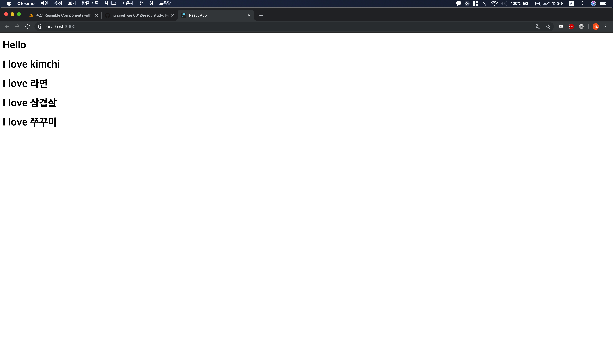

# 3. Component

## 3.1. Component

컴포넌트를 만드는 방법은 별도의 js 파일을 만드는 방법이 있고, 기존 js 파일에 추가로 작성하는 방법이 있다.

1. 별도의 js 파일 만들어 관리하기

   a. src 폴더 내에 Potato.js라는 파일을 만든다.

   b. 다음 코드를 작성한다.

      ```jsx
   // Potato.js
   
   import React from 'react';
      
      function Potato() {
        return (
          <h1>I love Potato</h1>
        );
      }
      
      export default Potato;
      ```

   c.  App.js로 돌아와서 다음 코드를 작성한다.

   ```jsx
   // App.js
   
   import React from 'react';
   import Potato from './Potato'
   
   function App() {
   	return (
     	<div>
       	<h1>Hello</h1>
         <Potato />
       </div>
     );
   }
    
   export default App;
   ```

   d. 다음과 같은 화면을 확인할 수 있다.

      

2. App.js 내에 function 형태로 작성하기

   a. App.js 내에 다음 코드를 작성한다.

   ```jsx
   import React from 'react';
   
   function Potato() {
     return (
       <h1>I love potato</h1>
     );
   }
   
   function App() {
     return (
       <div>
         <h1>Hello</h1>
         <Potato />
       </div>
     );
   }
   
   export default App;
   
   ```

   b. 다음과 같은 화면을 확인할 수 있다.

   

## 3.2. props 

Component는 HTML의 묶음이다. 어떻게 동적으로 사용할 수 있을까?
예를 들면, Food라는 Component를 선언하고, 어떨 때는 kimchi, 어떨 때는 potato가 나오게 할 수 없을까?

props 개념을 활용하면 동적으로 Component를 만들 수 있다.

먼저, 다음 코드를 작성하자

```jsx
import React from 'react';

function Food(props) {
  return (
  <h1>I love { props.fav }</h1>
  );
}

function App() {
  return (
    <div>
      <h1>Hello</h1>
      <Food fav="kimchi"/>
      <Food fav="라면"/>
      <Food fav="삼겹살"/>
      <Food fav="쭈꾸미"/>
    </div>
  );
}

export default App;

```

props는 부모 컴포넌트(위 경우에선 App)에서 자식 컴포넌트(위 경우에선 Food) 에 데이터를 넘겨주고 싶을 때 사용한다.
html에서 태그에 attribute(속성)을 주는 것 처럼 사용하면 되고, 자식 컴포넌트에서는 props를 인자로 받아 props.fav 의 형태로 사용하면 된다.
ES6를 지원하는 브라우저에서는 다음과 같이 사용할 수도 있다.

```jsx
import React from 'react';

function Food({ fav }) {
  return (
  <h1>I love { fav }</h1>
  );
}

function App() {
  return (
    <div>
      <h1>Hello</h1>
      <Food fav="kimchi"/>
      <Food fav="라면"/>
      <Food fav="삼겹살"/>
      <Food fav="쭈꾸미"/>
    </div>
  );
}

export default App;

```

구동 화면은 다음과 같다.



 

JavaScript map 함수를 사용하면 보다 편하게 component에 props를 넣을 수 있다. JavaScript는 Lambda식을 지원하는 대표적인 언어로, 아래와 같이 코드를 작성할 수 있다.

```jsx
import React from 'react';

function Food({ name, image }) {
  return (
    <div>
      <h2>I love { name }</h2>
      
    </div>
  );
}

const foodILike = [
  {
    name: "김치",
    image: "http://aeriskitchen.com/wp-content/uploads/2008/09/kimchi_bokkeumbap_02-.jpg"
  },

  {
    name: "삼겹살",
    image: "https://image.chosun.com/sitedata/image/201902/24/2019022401106_0.jpg"
  },

  {
    name: "라면",
    image: "http://file.mk.co.kr/meet/neds/2017/09/image_readtop_2017_587233_15042337473013492.jpg"
  }
]

function App() {
  return (
    <div>
      <h1>Hello</h1>
      {foodILike.map(dish => 
        <Food name={ dish.name } image={ dish.image }/>
      )}
    </div>
  );
}

export default App;

```

map 함수는 javascript array 내의 각 원소에 접근할 수 있는 함수이다. 따라서, map 함수 내에 <Food /> 컴포넌트를 삽입하면, props로 array의 원소를 넣을 수 있다.

구동 화면은 다음과 같다.


Lambda식이 익숙하지 않다면, 아래와 같이 함수를 별도로 선언하고 map 함수에 인자로 넘겨주는 방법도 가능하다.

```jsx
...

function renderFood(dish) {
  return <Food name={ dish.name } image= { dish.image }/>
}

function App() {
  return (
    <div>
      <h1>Hello</h1>
      {/* {foodILike.map(dish => 
        <Food name={ dish.name } image={ dish.image }/>
      )} */}
      {foodILike.map(renderFood)}
    </div>
  );
}

...
```

Chrome 콘솔 창을 보면 
Warning: Each child in a list should have a unique "key" prop
이라는 경고 창이 뜨는데, 이건 React의 기본 규칙 중 하나인 단일성(Uniqueness)에 위배되기 때문이다.
해결하는 방법은 아래 처럼 컴포넌트에 "key" prop을 추가하면 된다.

```jsx
...

const foodILike = [
  {
    key: 1,
    name: "김치",
    image: "http://aeriskitchen.com/wp-content/uploads/2008/09/kimchi_bokkeumbap_02-.jpg"
  },

  {
    key: 2,
    name: "삼겹살",
    image: "https://image.chosun.com/sitedata/image/201902/24/2019022401106_0.jpg"
  },

  {
    key: 3,
    name: "라면",
    image: "http://file.mk.co.kr/meet/neds/2017/09/image_readtop_2017_587233_15042337473013492.jpg"
  }
]

...

<Food key={ dish.key } name={ dish.name } image={ dish.image }/>

...
```

추가로, create-react-app으로 제작한 React 프로젝트의 경우, img 태그에 alt 속성을 넣지 않으면 경고가 뜬다. alt는 이미지가 제대로 로드되지 않거나 시각 장애인용 Screen Reader 프로그램에서 활용하는 정보로, 이미지의 대략적인 설명을 해 주면 된다. 아래와 같이 작성해보자.

```jsx
...


...
```


마지막으로, PropTypes를 활용하면 Component가 가진 props의 이름과 type을 사전에 체크할 수 있다.

1. npm에서 prop-types를 설치한다.

   ` npm install prop-types`

2. package.json에서 prop-types가 잘 설치되어 있는지 확인한다.

   ```json
   "dependencies": {
       ...
       "prop-types": "^15.7.2",
       ...
     }
   ```

3. App.js에 PropTypes를 import 한다.

   ```jsx
   import PropTypes from 'prop-types';
   ```

4. prop을 검사하고 싶은 컴포넌트에 대하여 아래와 같이 코드를 작성한다.

   ```jsx
   ...
   Food.propTypes = {
     name: PropTypes.string.isRequired,
     image: PropTypes.string.isRequired,
     rating: PropTypes.number
   }
   ...
   ```

위와 같이 작성하면, Food 컴포넌트가 name과 image를 가지고 있는지 확인할 수 있고, name, image가 string 타입인지 확인할 수 있으며, rating이 number 타입인 것을 확인할 수 있다. 만약 조건 중 잘못된 것이 있다면, Chrome 콘솔 창에 다음과 같은 경고 메시지를 띄운다.

Warning: Failed prop type: Invalid prop `rating` of type `string` supplied to `Food`, expected `number`

PropTypes에 대한 자세한 설명은 [공식 문서](https://ko.reactjs.org/docs/typechecking-with-proptypes.html)에서 확인할 수 있다.