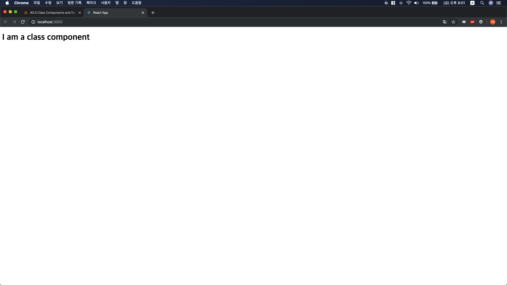
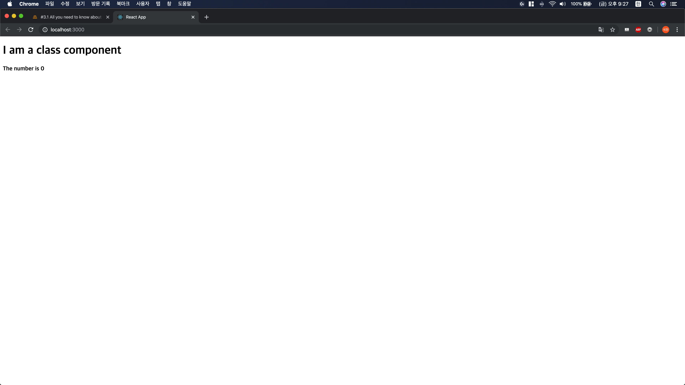
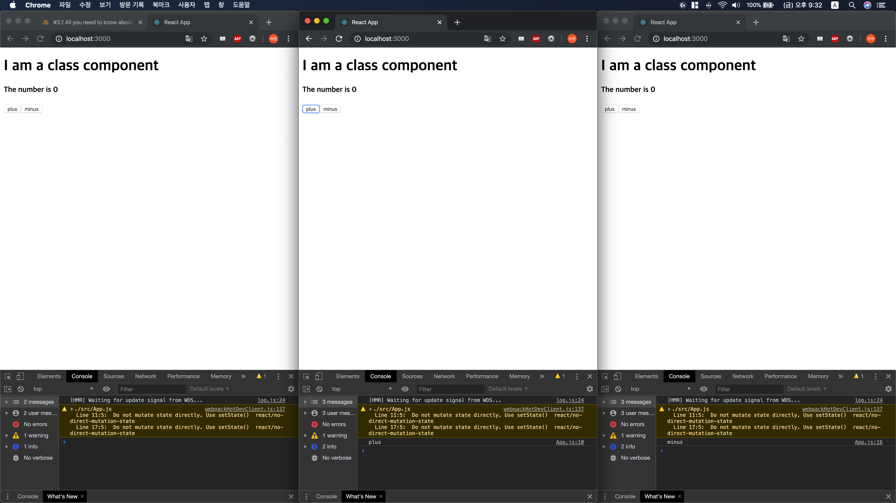
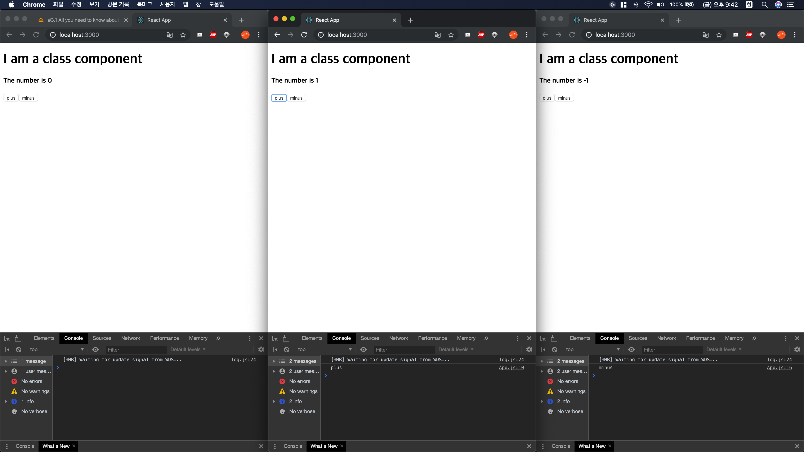
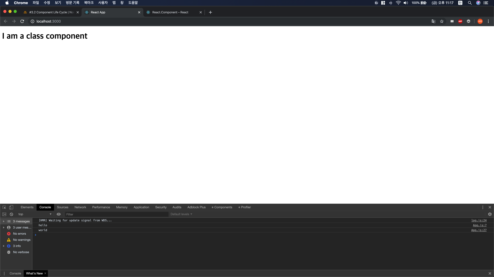
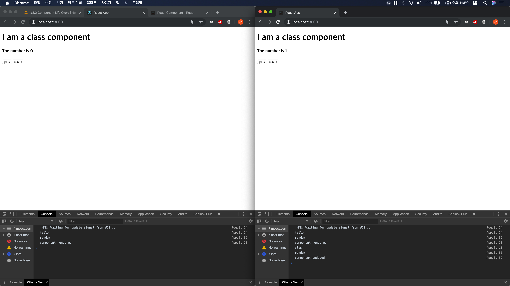

# 4. State

## 4.1 Function-Component 와 Class-Component

​	Function-Component는 우리가 지금까지 써 왔던 `function App() { return <h1>hello</h1> }`와 같은 함수 	기반의 component이고, Class-Component란 이제부터 배울 아래와 같은 형식의 component를 의미한다.

```jsx
class App extends React.Component {
  render() {
    return <h1>I am a class component</h1>
  }
}
```

 클래스 개념을 도입했기 때문에 상속(Extension) 이 가능하고, 모든 Class 기반 React Component는 React.Component를 상속받는다. Function 기반의 component에서 return 문에 작성했던 jsx 코드를 render 메소드로 선언하면 된다.

 React는 class component의 render 메소드를 실행한다.

 위 코드의 구동 화면은 다음과 같다.




왜 Class Component를 사용하는 것일까?

React.Component를 상속받으면 state를 사용할 수 있기 때문이다!

## 4.2 State

State는 component의 데이터를 담는 객체다. 
데이터가 변할 때 사용한다. 이것이 props와 state의 가장 큰 차이점이다.

state는 다음과 같이 사용한다.

```jsx
...
class App extends React.Component {

  state = {
    count: 0
  }
 
  render() {
    return (
    <div>
      <h1>I am a class component</h1>
      <h4>The number is { this.state.count }</h4>
    </div>
    )
  }
}

export default App;

...
```

구동 화면은 아래와 같다



state는 데이터가 변할 때 사용한다고 했는데, 어떻게 데이터를 변화시킬 수 있을까?

버튼을 만들어 state.count를 변경시키면 될 것이다.

```jsx
...
state = {
    count: 0
  }

  plus = () => {
    console.log("plus")
    this.state.count += 1
  };
  minus = () => {
    console.log("minus")
    this.state.count -= 1
  };
  render() {
    return (
    <div>
      <h1>I am a class component</h1>
      <h4>The number is { this.state.count }</h4>
      <button onClick={ this.plus }>plus</button>
      <button onClick = {this.minus }>minus</button>
    </div>
    )
  }
...
```

구동 화면은 다음과 같다. 그런데 어딘가 좀 이상하다.



plus 버튼과 minus 버튼을 누르면 콘솔 창에 "plus" 와 "minus" 라고 찍히는 걸로 보아  각 메소드를 잘 실행하고 있는데, 화면에 찍힌 값은 그대로 0 이다. 그리고 콘솔 창에는 Do not mutate state directly. Use setState()  라는 경고 메시지가 찍힌다. 왜 화면의 숫자는 변하지 않고, 이런 경고 메시지가 뜨는 것일까?

정답은 render() 에 있다. 앞에서도 간략히 짚고 넘어갔는데, 화면을 그려주는 것은 결국 render()라는 메소드가 하는 일이다. 따라서, state.count의 숫자를 바꿔도, render() 가 실행되지 않으면 실제 화면에 표시되는 숫자는 바뀌지 않는다. 이 때 사용하는 것이 경고 메시지에서 알려주는 setState() 메소드이다.

다음 코드를 작성하고 실행해보자

```jsx
...
plus = () => {
    console.log("plus")
    // this.state.count += 1 잘못된 코드
    this.setState({ count: this.state.count+1 })
  };
  minus = () => {
    console.log("minus")
    this.setState({ count: this.state.count-1 })
  };
...
```

setState() 메소드는 이름에서 알 수 있듯, state를 설정하는 메소드이다. 앞서 해봤던 방법과 다른 점은, setState() 메소드는 state를 수정한 후, render() 메소드를 수행해 변경된 state의 값을 수정한다. React는 Virtual DOM 기반으로 동작하므로, 화면을 다시 그릴 때 모든 요소를 새로 그리지 않고, 변경된 요소만 새로 그리기 때문에 빠르고 효율적이다.

위 코드의 구동 화면은 아래와 같다.



추가로, setState() 메소드는 Lambda식을 지원한다. 따라서 다음과 같이 작성해도 똑같이 동작한다.

```jsx
...
plus = () => {
    console.log("plus")
    this.setState(current => ({ count: current.count +1 }))
  };
  minus = () => {
    console.log("minus")
    this.setState(current => ({ count: current.count -1 }))
  };
...
```

## 4.3 Component Life Cycle

component는 여러 개의 메소드를 가지는데, 이 메소드들이 수행되는 순서가 있다.
크게 Mounting, Updating, Unmounting 3개의 과정으로 구분되며, 각 과정마다 순서는 1번부터 차례대로 수행된다.

#### Mounting: component가 생성될 때 수행되는 메소드들

1. constructor(): JavaScript에서 class를 만들 때 호출하는 것

```jsx
...
class App extends React.Component {

  constructor() {
    super();
    console.log("hello")
  }
  
  render() {
    console.log("world")
    return (
        <h1>I am a class component</h1>
    )
  }
}
```

콘솔 창을 확인해보면 "hello" 가 "world"보다 먼저 찍히는 것을 볼 수 있다.



2. render(): 우리가 가장 자주 사용하는 render() 메소드는 Mounting의 과정 중 수행된다.

3. componentDidMount(): render() 이후에 수행되는 메소드이다.

```jsx
class App extends React.Component {

  constructor() {
    super();
    console.log("hello")
  }

  componentDidMount() {
    console.log("component rendered")
  }

  render() {
    console.log("render")
    return (
    <div>
      <h1>I am a class component</h1>
    </div>
    )
  }
}
```


구동 화면은 아래와 같다. constructor() -> render() -> componentDidMount() 가 호출된다.


#### Updating: Component가 업데이트 될 때, 즉 setState() 메소드가 수행될 때 호출되는 메소드들

1. render() : component가 업데이트 될 때 re-rendering이 필요하다.

2. componentDidUpdate() : component가 업데이트 됐을 때, render() 이후에 호출되는 메소드

   ```jsx
   ...
   componentDidUpdate() {
       console.log("component updated")
     }
   
     render() {
       console.log("render")
       return (
       <div>
         <h1>I am a class component</h1>
         { <h4>The number is { this.state.count }</h4>
         <button onClick={ this.plus }>plus</button>
         <button onClick = {this.minus }>minus</button> }
       </div>
       )
     }
   ...
   ```

   구동 화면은 아래와 같다. 오른쪽 화면은 plus 버튼을 눌렀을 때인데, 콘솔 창을 보면 render가 한번 더 호출된 후, componentDidUpdate가 호출되는 것을 볼 수 있다.

   

#### Unmounting: component가 없어질 때 호출되는 메소드

1. componentWillUnmount() : component가 없어질 때 호출된다. 예를 들면, 다른 작업을 수행하면서 원래 사용하던 component를 없애거나, 다른 페이지로 이동할 때 등이다.

   ```jsx
   componentWillUnmount() {
     console.log("Goodbye!")
   }
   ```

   컴포넌트가 사라지는 상황을 만들지 못해서 구동 화면은 없다. 하지만 컴포넌트가 없어질 때 구현해야 할 것들은 이 메소드를 활용하여 만들면 된다.