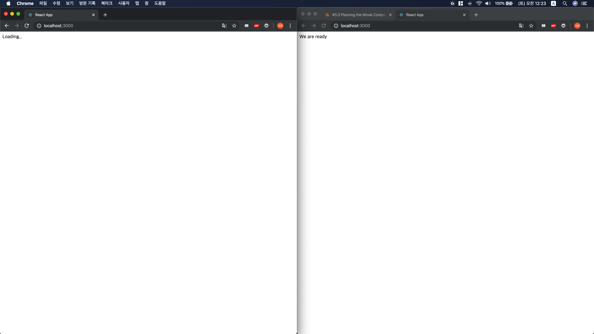
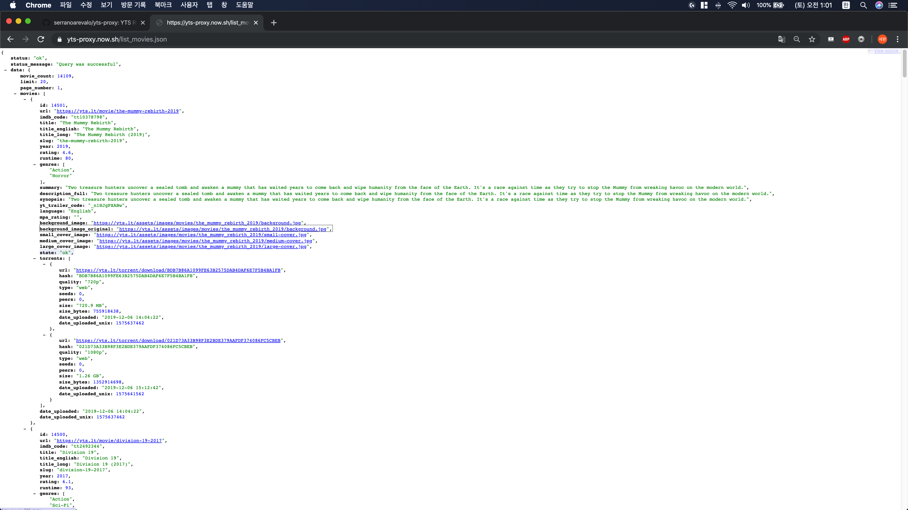
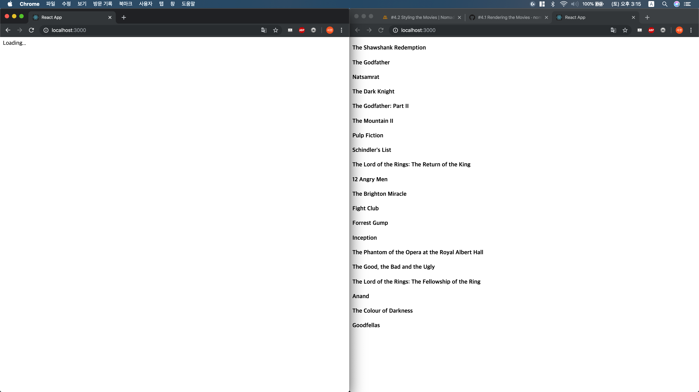
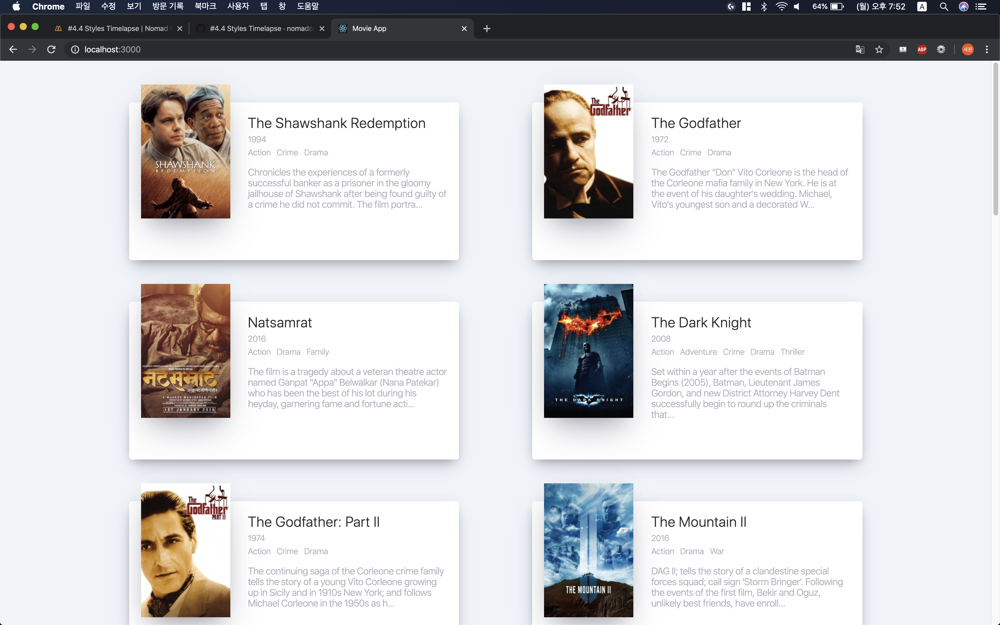

# 5. Movie

<hr/>
## 5.1 Movie 앱 준비하기

```jsx
import React from 'react';

class App extends React.Component {

  state = {
    isLoading: true
  }

  componentDidMount() {
    setTimeout(() => {
      this.setState({isLoading: false})
    }, 6000)
  }
  render() {
    
    return (
    <div>
      { this.state.isLoading ? "Loading..." : "We are ready" }
    </div>
    )
  }

}

export default App;
```

1. state를 정의한다. 6초 후 화면을 다시 그리기 위하여 isLoading이라는 boolean 변수를 state 내에 선언한다.

2. render() 메소드를 수행한다. 처음에는 isLoading이 true 이므로, Loading... 이라는 문자열을 화면에 그려준다.

3. render() 메소드 수행 후 호출되는 componentDidMount() 를 사용한다. 추후에 여기에 Data Fetching 부분을 작성할 것이다. 지금은 6초 후 isLoading 이라는 state가 false가 되도록 바꿔준다. setState()가 호출됨으로 render() 가 다시 한 번 수행되게 되는데, isLoading이 false이기 때문에 We are ready라는 문자열을 화면에 그려준다. 

   구동 화면은 아래와 같다. 왼쪽이 처음 화면이고, 오른 쪽이 6초가 지난 후의 화면이다.



## 5.2 Axios & API

1. Axios 설치

   `npm install axios`

   Axios는 fetch API를 기반으로 만들어진 것으로, 보다 편하게 데이터를 읽어올 수 있게 하는 Tool이다.

2. 데이터는 NomadCoder 가 제공한 <https://yes-proxy.now.sh>에서 가져올 것이다.

   1. 영화 리스트는 <https://yts-proxy.now.sh/list_movies.json> 에서 받아올 수 있다.

   2. Chrome Extension 중 JSONView 라는 확장 프로그램 설치를 권장한다. 위 주소로부터 받은 데이터를 JSONView를 통해 파싱하면 아래와 같다.

      

   3. 다음 코드를 작성한다.
   
      ```jsx
      import React from 'react';
      import axios from 'axios';
      
      class App extends React.Component {
        ...
        
        getMovies = async() => {
          const movies = await axios.get('https://yts-proxy.now.sh/list_movies.json')
        }
        
        componentDidMount() {
          this.getMovies();
        }
      
      	render() {
          ...
          );
        }
      }
      
      export default App;
      ```
   
      앞서 설치한 axios를 활용하기 위하여 두 번째 줄에서 axios를 import 했다. 
   
      axios.get() 메소드는 해당 주소에 REST API의 "GET" 접근을 하여 데이터를 받아오는 것이다. 
   
      그리고 axios.get() 메소드는 받아오는 데이터의 크기에 따라 시간이 조금 걸릴 수 있으므로, JavaScript ES6부터 지원하는 async/await 기능을 활용한다.
   
      async/ await을 간단히 설명하자면, 저 둘이 없으면 JavaScript는 데이터를 다 받아오지 못해도 getMovies() 메소드를 종료시키지만, async/await을 사용하면 데이터를 모두 받을 때까지 기다렸다가 getMovies() 메소드를 종료시킨다.
   
   
   
   ## 5.3 제목 뿌리기
   
    데이터를 받아오는 방법을 알았다. 이제 받아온 데이터를 화면에 뿌려보자
   
   1. Movie.js라는 새 컴포넌트를 만든다.
   
      ``` jsx
      import React from "react";
      import PropTypes from "prop-types";
      
      function Movie({ id, year, title, summary, poster }) {
          return <h4>{ title }</h4>
      }
      
      Movie.propTypes = {
          id: PropTypes.number.isRequired,
          year: PropTypes.number.isRequired,
          title: PropTypes.string.isRequired,
          summary: PropTypes.string.isRequired,
          poster: PropTypes.string.isRequired
      }
      
      export default Movie;
      ```
   
      App에서 필요한 영화의 id, year, title, summary, 그리고 poster 를 가져온다. 앞서 배웠던 PropTypes를 활용하여 제대로 된 props가 들어갔는지 다시 한 번 확인한다.
   
   2. App.js에 Movie 컴포넌트를 import하고, 사용한다.
   
      ```jsx
      ...
      import Movie from './Movie';
      ...
      
      const { data:
            { data:
              { movies }
            }
          } = await axios.get('https://yts-proxy.now.sh/list_movies.json?sort_by=rating')
          this.setState({ movies, isLoading: false })
      
      ...
      
      render() {
          const { isLoading, movies } = this.state;
          return (
            <div>
              {isLoading
                ? "Loading..."
                : movies.map(movie => (
                  <Movie
                    key={movie.id}
                    id={movie.id}
                    year={movie.year}
                    title={movie.title}
                    summary={movie.summary}
                    poster={movie.medium_cover_image}
                  />
                )
                )
              }
            </div>
          );
        }
      
      ...
      ```
   
      API에서 받아온 데이터를 변수에 저장한다. 실제 우리가 필요한 데이터는 JSON 파일의 data 안의 data 안의 movies 에 들어가있다. 따라서, ES6 문법에 따라 위와 같이 {data: {data: { movies }}} 라고 작성하면 movies 라는 변수 안에 우리가 필요로 하는 데이터가 들어간다.
   
      render() 메소드에서는 매번 this.state 를 호출하지 않기 위하여 { movies }를 const로 선언해준다.
   
      앞에서 배웠던 movies.map() 함수를 활용하여 movies 배열 내의 각 movie에 대하여 <Movie /> 컴포넌트를 만들고, props로 각 movie의 id와 year, title, summary, 그리고 medium_cover_image를 사용할 수 있게 한다.
   
   3. 구동 화면은 아래와 같다.
   
      

## 5.4 완성하기

제목까지 받아올 수 있으면, 이제 남은 일은 다른 정보를 제목과 함께 뿌리고, CSS를 입혀 보기 좋게 만드는 것이다.
더 보기 좋은 앱을 만들기 위해, API에서 제공하는 장르 정보도 함께 뿌려줄 예정이다.

1. 다른 정보 함께 뿌리기

   ```jsx
   // Movie.js
   
   import React from "react";
   import PropTypes from "prop-types";
   
   function Movie({ year, title, summary, poster, genres }) {
       return (
           <div className="movie">
               
               <div className="movie__data">
                   <h3 className="movie__title">{title}</h3>
                   <h3 className="movie__year">{year}</h3>
                   <ul className="movie__genres">{genres.map((genre,index) => <li key={index} className="genres__genre">{genre}</li>)}</ul>
                   <p className="movie__summary">{summary.slice(0,180)}...</p>
               </div>
           </div>
       )
   }
   
   Movie.propTypes = {
       id: PropTypes.number.isRequired,
       year: PropTypes.number.isRequired,
       title: PropTypes.string.isRequired,
       summary: PropTypes.string.isRequired,
       poster: PropTypes.string.isRequired,
       genres: PropTypes.arrayOf(PropTypes.string).isRequired
   }
   
   export default Movie;
   ```

   Movie.js에서는 genres를 추가했고, propTypes에서는 genre가 string array이므로 이 자료형이 맞는지 체크하게 하였다. JSX에서는 class라는 단어를 이미 예약어로 지정해놓았기 때문에, HTML에서 쓰던 class 속성은 className으로 바꿔 사용한다.
   genres는 앞서 사용했던 Array.map() 함수를 활용하여 여러 장르를 한 눈에 보기 쉽게 표현한다.

   ```jsx
   // App.js
   // render() 의 return 문 안에 작성한다.
   ...
   <section className="container">
           {isLoading ? (
             <div className="loader">
               <span className="loader__text">Loading...</span>
             </div>
           ) : (
               <div className="movies">
                 {movies.map(movie => (
                   <Movie
                     key={movie.id}
                     id={movie.id}
                     year={movie.year}
                     title={movie.title}
                     summary={movie.summary}
                     poster={movie.medium_cover_image}
                     genres={movie.genres}
                   />
                 ))}
               </div>
             )}
         </section>
   ...
   ```

   App.js에서는 앞서 Movie.js에서 추가한 genres를 속성값으로 넘겨주도록 한다.

2. CSS 입히기

   CSS는 NomadCoder에서 제공하는 템플릿을 입혔다. [여기](https://github.com/nomadcoders/movie_app_2019/commit/c0a3270f5824c2555e2621190c6307cbaefe0704)에서 확인할 수 있다.

   ```css
   /* Movie.css */
   .movies .movie {
     width: 45%;
     background-color: white;
     margin-bottom: 70px;
     display: flex;
     align-items: flex-start;
     justify-content: space-between;
     font-weight: 300;
     padding: 20px;
     border-radius: 5px;
     color: #adaeb9;
     box-shadow: 0 13px 27px -5px rgba(50, 50, 93, 0.25),
       0 8px 16px -8px rgba(0, 0, 0, 0.3), 0 -6px 16px -6px rgba(0, 0, 0, 0.025);
   }
   
   .movie img {
     position: relative;
     top: -50px;
     max-width: 150px;
     width: 100%;
     margin-right: 30px;
     box-shadow: 0 30px 60px -12px rgba(50, 50, 93, 0.25),
       0 18px 36px -18px rgba(0, 0, 0, 0.3), 0 -12px 36px -8px rgba(0, 0, 0, 0.025);
   }
   
   .movie .movie__title,
   .movie .movie__year {
     margin: 0;
     font-weight: 300;
   }
   
   .movie .movie__title {
     margin-bottom: 5px;
     font-size: 24px;
     color: #2c2c2c;
   }
   
   .movie .movie__genres {
     list-style: none;
     padding: 0;
     margin: 0;
     display: flex;
     margin: 5px 0px;
   }
   
   .movie__genres li,
   .movie .movie__year {
     margin-right: 10px;
     font-size: 14px;
   }
   ```

   

   ```css
   /* App.css */
   * {
     box-sizing: border-box;
   }
   
   body {
     margin: 0;
     padding: 0;
     font-family: -apple-system, BlinkMacSystemFont, 'Segoe UI', Roboto, Oxygen, Ubuntu, Cantarell, 'Open Sans', 'Helvetica Neue', sans-serif;
     background-color: #eff3f7;
     height: 100%;
   }
   
   html, body, #root, .container {
     height: 100%;
     display: flex;
     justify-content: center;
   }
   
   .loader {
     width: 100%;
     height: 100%;
     display: flex;
     justify-content: center;
     align-items: center;
   }
   
   .movies {
     display: flex;
     justify-content: space-between;
     align-items: flex-start;
     flex-wrap: wrap;
     padding: 50px;
     padding-top: 70px;
     width: 80%;
   }
   ```

   이 두 CSS 파일을 우리가 작성한 Movie.js와 App.js에 적용하려면 `import "./App.css"` 와 같은 형태로 각 js 파일에 import 시켜주면 된다.

   ```jsx
   // App.js
   import React from 'react';
   ...
   import './App.css'
   ```

3. 1번과 2번을 모두 적용한 구동 화면은 아래와 같다.

