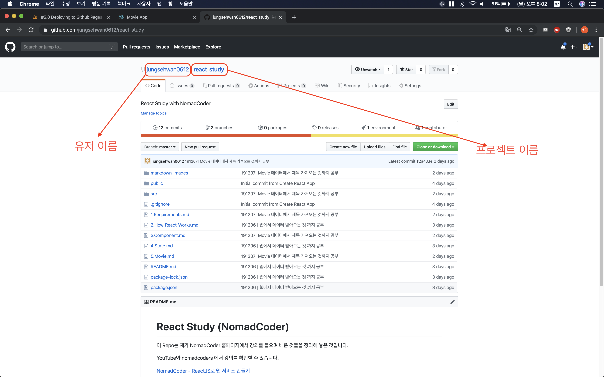
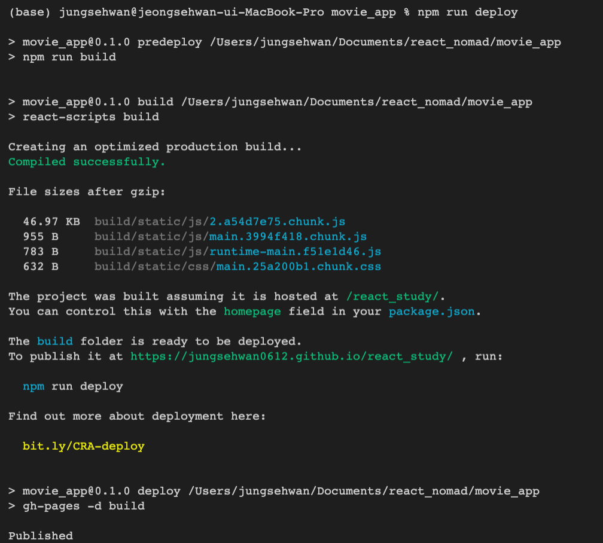
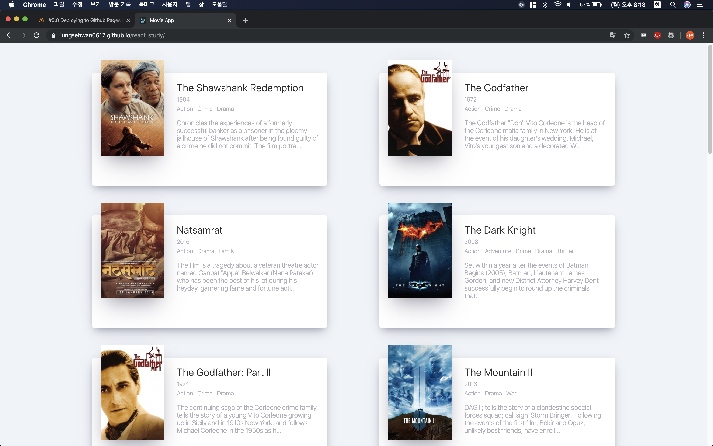

# 6. Deploying App via Github Pages

<hr/>

## 6.1 gh-pages 설치

`npm i gh-pages`

## 6.2 package.json 수정하기

1. 가장 마지막에 "homepage" 항목 추가하기

   ```json
   {
     "name": "movie_app",
     "version": "0.1.0",
     "private": true,
     "dependencies": {
       ...
       "axios": "^0.19.0",
       "gh-pages": "^2.1.1",
       "prop-types": "^15.7.2",
       "react": "^16.12.0",
       ...
     },
   ...
     "browserslist": {
       "production": [
         ">0.2%",
         "not dead",
         "not op_mini all"
       ],
       "development": [
         "last 1 chrome version",
         "last 1 firefox version",
         "last 1 safari version"
       ]
     },
     "homepage": "https://jungsehwan0612.github.io/react_study/"
   }
   
   ```

   제일 마지막 줄에 ,를 넣고 "homepage" 항목을 추가한다. homepage 항목에는 

   `https://(GitHub 유저 이름).github.io/(프로젝트 이름)/`

   을 넣는다.

   

2. scripts 항목 수정

   scripts 항목을 찾아 다음과 같이 수정한다.

   ```json
   {
     "name": "movie_app",
     "version": "0.1.0",
     "private": true,
     "dependencies": {
       ...
       "axios": "^0.19.0",
       "gh-pages": "^2.1.1",
       "prop-types": "^15.7.2",
       "react": "^16.12.0",
       ...
     },
     "scripts": {
       "start": "react-scripts start",
       "build": "react-scripts build",
       "test": "react-scripts test",
       "eject": "react-scripts eject",
       "deploy": "gh-pages -d build",
       "predeploy": "npm run build"
     },
     ...
     "homepage": "https://jungsehwan0612.github.io/react_study/"
   }
   
   ```

   scripts에 deploy와 predeploy 스크립트를 추가한다. deploy 스크립트는 앞서 설치했던 gh-pages를 이용하여 우리의 컴파일된 웹 페이지를 담은 폴더(build 폴더)가 GitHub Pages에 업로드되도록 해주는 것이고, predeploy 스크립트는 deploy 전에 수행되는 예약어로, build 폴더를 만들어주는 역할을 한다.

3. Deploy 하기

   ` npm run deploy ` 명령어를 터미널 창에 입력하면 앞서 스크립트로 작성한 predeploy와 deploy가 동작하며 아래와 같이 진행된다.

   

4. 배포 중인 웹 페이지를 들어가보면 아래와 같은 페이지가 나온다.

   