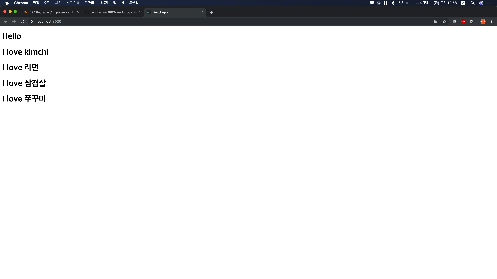

# React Study (NomadCoder)

## 1. Requirements

1. [node.js 설치](https://nodejs.org/ko/)

2. npm 설치(node.js 설치하면 같이 설치된다.)

3. npx 설치 
  
    `npm install -g npx`

4. create-react-app을 활용하여 원하는 위치에 react app 만들기 

    `npx create-react-app movie_app`

## 2. React가 작동하는 원리
1. public 디렉토리 내의 index.html을 보여준다.

2. index.html 내의 `<div id=root></div>` 안쪽에 우리가 React로 작업한 코드가 HTML과 JavaScript로 변환되어 들어간다.
  
3. 원리는 index.js의 `ReactDOM.render(<App />, document.getElementById('root'));` 부분이 우리가 만든 App.js 의 App() 함수가 반환하는 것을 root라는 ID를 가진 div 내에 삽입하는 방식이다. 이 방식을 Virtual DOM(Document Oriented Model)을 만들었다고 한다.

4. 그렇기 때문에, index.html의 소스 코드를 보면 우리가 작업한 React 코드가 나오지 않는다. Chrome의 콘솔 창에서 봐야한다.

## 3.1. Component

컴포넌트를 만드는 방법은 별도의 js 파일을 만드는 방법이 있고, 기존 js 파일에 추가로 작성하는 방법이 있다.

1. 별도의 js 파일 만들어 관리하기

   a. src 폴더 내에 Potato.js라는 파일을 만든다.

   b. 다음 코드를 작성한다.

      ```jsx
      import React from 'react';
      
      function Potato() {
        return (
          <h1>I love Potato</h1>
        );
      }
      
      export default Potato;
      ```

   c.  App.js로 돌아와서 다음 코드를 작성한다.

   ```jsx
    import React from 'react';
    import Potato from './Potato'
   
    function App() {
        return (
        <div>
            <h1>Hello</h1>
            <Potato />
        </div>
        );
    }
    
    export default App;
   ```

   d. 다음과 같은 화면을 확인할 수 있다.

      

2. App.js 내에 function 형태로 작성하기

    a. App.js 내에 다음 코드를 작성한다.
    
    ```jsx
    import React from 'react';
    
    function Food() {
      return (
        <h1>I love potato</h1>
      );
    }
    
    function App() {
      return (
        <div>
          <h1>Hello</h1>
          <Potato />
        </div>
      );
    }
    
    export default App;
    
    ```
    
    b. 다음과 같은 화면을 확인할 수 있다.
    
    

## 3.2. props

Component는 HTML의 묶음이다. 어떻게 동적으로 사용할 수 있을까?
예를 들면, Food라는 Component를 선언하고, 어떨 때는 kimchi, 어떨 때는 potato가 나오게 할 수 없을까?

props 개념을 활용하면 동적으로 Component를 만들 수 있다.

먼저, 다음 코드를 작성하자

```jsx
import React from 'react';

function Food(props) {
  return (
  <h1>I love { props.fav }</h1>
  );
}

function App() {
  return (
    <div>
      <h1>Hello</h1>
      <Food fav="kimchi"/>
      <Food fav="라면"/>
      <Food fav="삼겹살"/>
      <Food fav="쭈꾸미"/>
    </div>
  );
}

export default App;

```

props는 부모 컴포넌트(위 경우에선 App)에서 자식 컴포넌트(위 경우에선 Food) 에 데이터를 넘겨주고 싶을 때 사용한다.
html에서 태그에 attribute(속성)을 주는 것 처럼 사용하면 되고, 자식 컴포넌트에서는 props를 인자로 받아 props.fav 의 형태로 사용하면 된다.
ES6 이상을 지원하는 브라우저에서는 다음과 같이 사용할 수도 있다.

```jsx
import React from 'react';

function Food({ fav }) {
  return (
  <h1>I love { fav }</h1>
  );
}

function App() {
  return (
    <div>
      <h1>Hello</h1>
      <Food fav="kimchi"/>
      <Food fav="라면"/>
      <Food fav="삼겹살"/>
      <Food fav="쭈꾸미"/>
    </div>
  );
}

export default App;

```

구동 화면은 다음과 같다.



 

